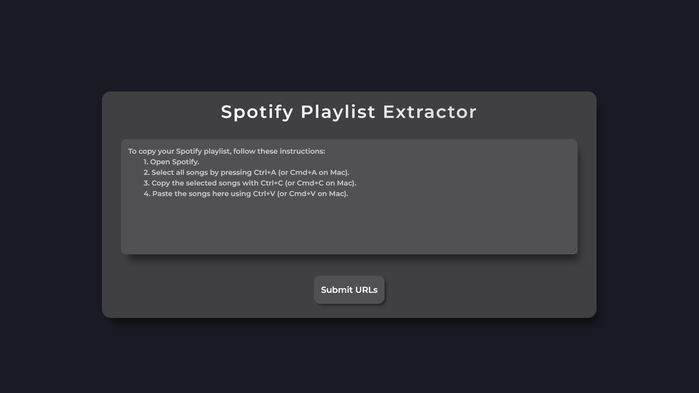
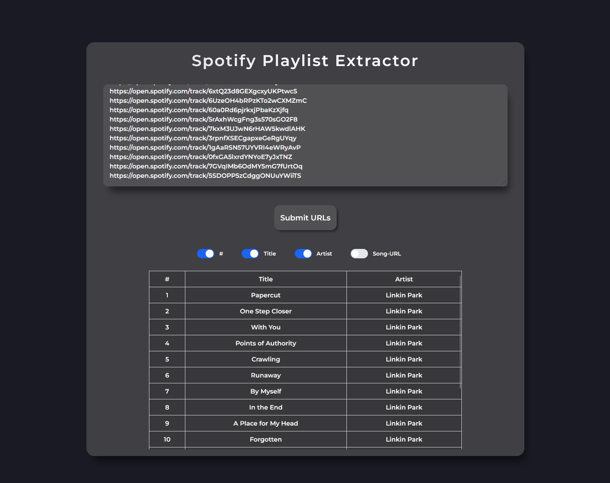

# Zeph - Spotify Playlist Extractor


[](https://github.com/psf/black)

[](https://github.com/Anemosx/zeph/actions/workflows/lint.yml)
[](https://github.com/Anemosx/zeph/actions/workflows/test.yml)

Zeph is a user-friendly tool designed to make extracting Spotify playlists effortless.
With Zeph, you can easily retrieve the songs from any Spotify playlist by simply
pasting its URL. Once the URL is provided, the tool quickly processes the playlist,
extracting all the tracks and presenting them in a neatly organized table.
Whether you’re curating music, analyzing playlists, or just saving your favorite songs,
Zeph streamlines the process, saving you time and effort.


## Installation

**Install Project Dependencies**
To get started, ensure you have Poetry installed to manage project dependencies.
Follow these steps:
1. Install Poetry:
   ```bash
   pip install poetry
   ```

2. Install the project dependencies:
   ```bash
   poetry install
   ```

## Running the Project

### 1. Running the Backend Server

Launch the backend server by executing the following command:

```bash
python app/main.py
```

### 2. Accessing the Frontend

With the server running, open your web browser and navigate to:

[http://localhost:8000](http://localhost:8000)



Follow the instructions on the page to extract your Spotify playlists.



Enjoy your music!
